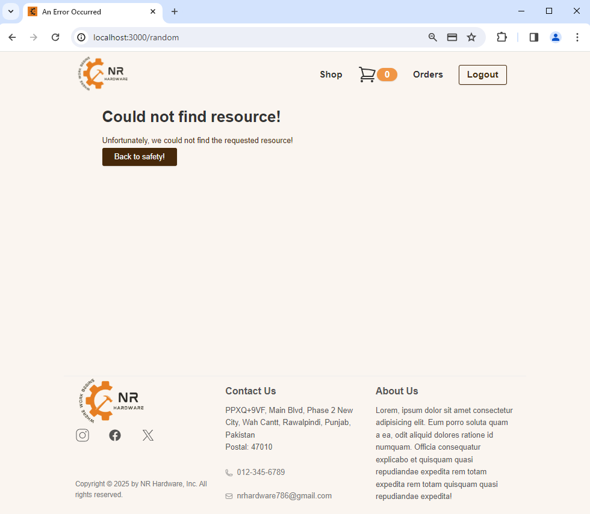

# 🛍️ NR Hardware E-Commerce Store

Welcome to the NR Hardware E-commerce Store, an online platform for all your hardware needs. Explore our wide range of products and enjoy a seamless shopping experience.

---

## Overview

In this project, I've developed an e-commerce web application following the MVC pattern, utilizing node.js, express, MySQL, and related technologies. The platform enables customers to view products, add them to the session cart, perform Stripe checkout, and track order status in real-time. Administrators, on the other hand, can efficiently manage the category and product catalogs through CRUD operations and update order status.

---

## Getting Started

To get started with our hardware e-commerce platform, follow these steps:

1. **Clone the Repository**: Run the following command to create a copy:

```
git clone https://github.com/Owais2099/NR-Hardware-Ecommerce-Website.git
```

2. **Environment Variables**: To configure environment variables, modify the values in the `.env` file You can utilize the default values provided and modify the variables for database configuration to match your specific settings.
   **Note:** It is strongly recommended not to upload the `.env` file to GitHub; it should be included in the `.gitignore` file. However, for development and to showcase the website's functionality, a sample .env file with dummy values is included. Ensure that you use more secure secret keys for production and avoid sharing them with others.

```
npm install
```

3. **Install Dependencies**: Run the following command to install all required dependencies:

```
npm install
```

4. **Set up Database**: Create a new MySQL database based on the blueprint shown below:
   
   **Note:** All columns are marked as `NOT NULL`, and each table has an `id` column, which serves as the primary key and auto-increments. Foreign keys are indicated with arrows for reference.

   - Make sure to keep table's and table_column's name same in your database so that you do not have to make changes to model files, and the application runs smoothly.

5. **Start the Application**: Launch the application using:

```
npm start
```

6. **Explore and Shop**: Open your web browser and go to the following address to start exploring and shopping:

```
http://localhost:3000
```

7. **Admin Privileges**: To grant admin privileges and access to the admin panel after signing up, set the `isAdmin` value to `1` for that specific user in the users table in the database.

---

## 📂 Content

The repository contains the files and folders detailed below:

- **_config_**: used to configure Express.js session, including settings for using a MySQL database to store session data.

- **_controllers_**: contains the components responsible for handling user interactions, processing data from the model, and sending appropriate responses to the view, effectively managing the application's logic.

- **_data_**: used to configure and establish a MySQL database connection pool, making it available for handling database operations efficiently.

- **_middlewares_**: contains files that define various middleware functions used, such as initializing shopping carts, verifying authentication status, handling CSRF tokens, custom error handling, image uploads, route protection for authorization, and updating cart prices, helping to streamline request processing and enhance application functionality while keeping the code maintainable.

- **_models_**: contains files that interact with the database, encapsulating the application's data logic, and serving as a bridge between the application and the database, facilitating data retrieval and manipulation.

- **_product-data_**: it is currently used to store product images that are uploaded when a new product is added by the admin. When scaling, we can use [Cloudinary](https://cloudinary.com/) to store images remotely for efficient management of large number of images.

- **_public_**: contains all the files shared with the users of the application, such as icons, stylesheets and scripts.

- **_routes_**: holds files that define and manage the routes and endpoints, handling incoming requests, invoking the appropriate controllers, and returning responses.

- **_screenshots_**: contains images used for project documentation in readme.md. (not part of the actual project)

- **_util_**: provides utility functions for validating user input and managing user authentication sessions

- **_views_**: contains files that define the structure and layout of web pages, helping to generate dynamic HTML content with [ejs templating engine](https://ejs.co/) and render it to the client's browser.

- **_.gitignore_**: used to indicate the files and folders to be ignored by the version control system _Git_.

- **_app.js_**: main entry point to the application, with the set up of our server with _**express**_ and calls (via `import`) to the different _npm_ packages used in the project.

- **_package.json_**: contains information about the project (name, version, etc.) including the packages installed as dependencies.

- **_README.md_**: this file.

---

## 📔 Features

### User Features

1. **User Authentication**

   - Create an account, log in, or log out to access personalized features.
     
     

2. **Product Browsing**

   - Browse an extensive catalog of hardware products added by the admin.
     
   - View Details of a single product.
     

3. **Session Shopping Cart**

   - Add products to your shopping cart, allowing you to collect your desired items before making a purchase.
     
   - Conveniently add or delete products from your shopping cart or adjust the quantity of items.
     
   - To complete a purchase, users must be logged in, ensuring a secure and personalized shopping experience.
     

4. **Secure Payments Using Stripe**

   - Our platform utilizes [Stripe](https://stripe.com/) for processing payments, providing a safe and reliable payment gateway for transactions. The website resembles a real store and you can add products to your cart and pay for them. If you want to try the checkout process, you can use the dummy card number provided by stripe for testing which is `4242 4242 4242 4242` with any expiration date, CVC, and zip codes. Please <u><b>DO NOT</b></u> provide real card number and data.
     
   - On successful order placement:
     

5. **Real-Time Order Tracking**
   - Access real-time tracking to stay informed about the status of your orders, ensuring transparency and peace of mind.
     

### Admin Features

1. **Product Management**

   - Admins can manage products by viewing, adding, editing, or deleting items from the catalog.
     
   - Manage Products:
     
   - Add New Product:
     
   - Update Product: (reset button allows to revert back any changes made to the last submitted data)
     

2. **Category Management**

   - Admins can manage product categories by adding, editing, or deleting them from the catalog.
     
   - Add New Category:
     
   - Update Category:
     

3. **Order Status Control**
   - Admins have the capability to update the status of orders, allowing for real-time order tracking and management.
     

### Additional Features

1. **Responsive Design**: The website is designed to be responsive, ensuring that users have an optimal experience regardless of the device they are using. Some of the examples for mobile are attached below.

   - Login Page:
     <p align="center">
       
     </p>

   - Side Menu:
     <p align="center">
       
     </p>

   - Product Catalog:
     <p align="center">
       
     </p>

   - Admin Product Catalog:
     <p align="center">
       
     </p>

   - Admin Product Category Catalog:
     <p align="center">
       
     </p>

   - Product Details:
     <p align="center">
       
     </p>

   - Cart:
     <p align="center">
       
     </p>

   - Orders:
     <p align="center">
       
     </p>

   - Manage Orders:
     <p align="center">
       
     </p>

2. **Secure User Accounts**: website offers complete authentication and authorization checks, password encryption and decryption using the [bcryptjs](https://www.npmjs.com/package/bcryptjs) package, and protection against XSS and CSRF attacks ([csrf-csrf](https://www.npmjs.com/package/csrf-csrf) package used) to safeguard your personal information.

   - Not Authenticated: (renders when a user attempts to access a page that is only accessible to logged-in users when the user has not actually logged in)
     
   - Not Authorized: (renders when a non-admin user tries to access pages accessible to admins only)
     

3. **Error Handling**: The application utilizes error handling for both frontend and backend code. This includes displaying helpful messages when errors occur.
   - Resource Not Found:
     
   - Invalid Credentials:
     

---

## Future Improvements

While the current version of NR Hardware E-commerce store offers a decent shopping experience, there's always room for further improvements. In future updates, I plan to focus on the following areas:

- **Advanced Product Search**: implement a powerful product search feature that will make it even easier for users to find the exact products they need quickly.

- **Category-Based Filtering**: enhance user experience by allowing customers to filter products based on categories, providing a more streamlined shopping experience.

Your feedback and contributions are always welcome, and together, we can make this project even better. Feel free to share your thoughts and ideas to help us shape the future of NR Hardware's e-commerce platform.

---

## ✒️ Author

- **Muhammad Owais** &#8594; [LinkedIn](https://www.linkedin.com/in/muhammad-owais-73b3b725b)
